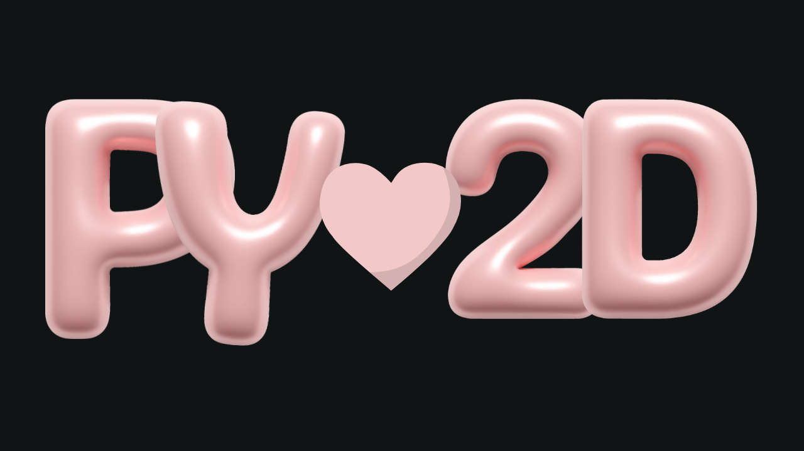

A small, batteries‑included Python framework that mirrors the LÖVE2D feel:


```python
import pylove2d as love


def load():
global x, y
x, y = 100, 100


def update(dt):
speed = 220
if love.input.key_down('left'): x -= speed * dt
if love.input.key_down('right'): x += speed * dt


def draw(g):
g.clear(0.1, 0.1, 0.12)
g.set_color(1, 0.6, 0.3)
g.rectangle('fill', x, y, 64, 64)
```


Install locally:


```bash
pip install -e .
```


Run your script:


```bash
python your_game.py
```


See `examples/pong/main.py` for a full example.